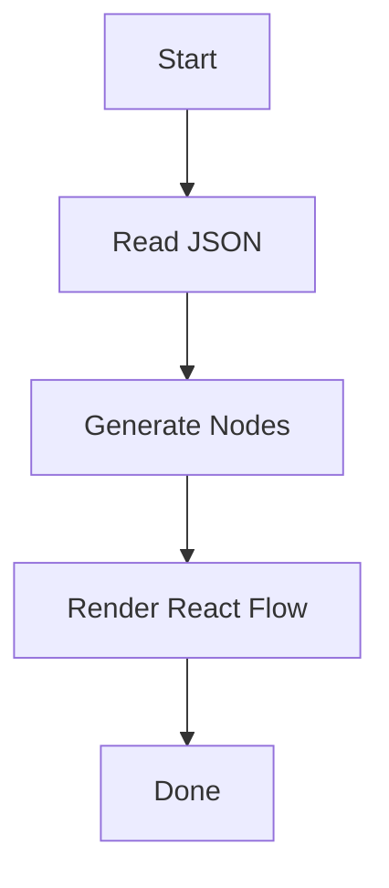

# React Flow

A modern React library for building **interactive node-based editors**, workflows, diagrams, and visual graph applications.

---

## Overview

React Flow allows developers to build highly interactive graph-based interfaces with minimal effort.

It provides built-in support for:

- Dragging nodes
- Connecting edges
- Zooming
- Panning
- Custom node components
- Custom edge rendering

:::tip

React Flow is only responsible for rendering and interaction. Your application owns the graph data.

:::

---

## Installation

:::install

npm
npm install @xyflow/react

pnpm
pnpm add @xyflow/react

yarn
yarn add @xyflow/react

:::

---

## Basic Usage

Import ReactFlow.

```tsx
import {
  ReactFlow,
  Background,
  Controls,
  MiniMap
} from "@xyflow/react";

export default function Flow(){

    return(
        <ReactFlow>
            <Background />
            <Controls />
            <MiniMap />
        </ReactFlow>
    )

}
```

---

## Folder Structure

:::tree

src/
├── app/
│   ├── page.tsx
│   └── layout.tsx
├── components/
│   ├── Flow.tsx
│   ├── Sidebar.tsx
│   └── Toolbar.tsx
├── lib/
│   ├── graph.ts
│   └── parser.ts
├── data/
└── styles/

:::

---

## Core Components

### ReactFlow

The main rendering component.

### Background

Adds a configurable grid.

### Controls

Provides zoom controls.

### MiniMap

Displays a miniature overview.

---

## Example Graph

```tsx
const nodes = [
    {
        id:"1",
        position:{x:0,y:0},
        data:{label:"Start"}
    }
]

const edges = [
    {
        id:"e1",
        source:"1",
        target:"2"
    }
]
```

---

## Common Props

| Property | Type | Description |
|----------|------|-------------|
| nodes | Node[] | Graph nodes |
| edges | Edge[] | Graph edges |
| fitView | boolean | Auto fit viewport |
| nodeTypes | object | Custom nodes |
| edgeTypes | object | Custom edges |

---

## Event Hooks

1. onNodesChange
2. onEdgesChange
3. onConnect
4. onNodeClick
5. onEdgeClick

---

## Custom Nodes

You can register your own node types.

```tsx
const nodeTypes = {
    custom: CustomNode
}
```

---

## Custom Edges

React Flow supports custom edge rendering.

```tsx
const edgeTypes = {
    floating: FloatingEdge
}
```

---

## Best Practices

- Keep graph state outside React Flow.
- Memoize custom nodes.
- Use unique IDs.
- Split graph logic from UI.
- Avoid unnecessary rerenders.

:::note

Large graphs should be virtualized whenever possible.

:::

---

## Performance

:::success

React Flow performs well even with hundreds of nodes when implemented correctly.

:::

---

## Common Mistakes

:::warning

Do not recreate the nodes array on every render.

:::

:::warning

Avoid generating random IDs during rendering.

:::

---

## Dangerous Practice

:::danger

Never mutate the nodes array directly.

Always create a new copy.

:::

---

## Keyboard Shortcuts

Press <kbd>Ctrl</kbd> + <kbd>S</kbd> to save.

Press <kbd>Delete</kbd> to remove selected nodes.

---

## Resource Tabs

:::tabs

=== React

Use ReactFlow.

=== Svelte

Use SvelteFlow.

=== Documentation

Official docs contain advanced examples.

:::

---

## Playground

:::playground

basic-flow

:::

---

## Demo

:::demo

drag-and-connect

:::

---

## Video Tutorial

:::video

https://www.youtube.com/watch?v=example

:::

---

## Reusable Component

:::component

FlowExample

:::

---

## Version

:::version

12.0

:::

---

## Difficulty

:::badge

Intermediate

:::

---

## Resources

:::resources

Official Documentation
https://reactflow.dev

GitHub
https://github.com/xyflow/xyflow

Discord
https://discord.gg

Examples
https://reactflow.dev/examples

:::

---

## Related Libraries

:::related

lucide-react

framer-motion

react-hook-form

zustand

:::

---

## API Example

| API | Description |
|------|-------------|
| useNodesState | Node state hook |
| useEdgesState | Edge state hook |
| useReactFlow | Flow instance |
| addEdge | Utility |

---

## Checklist

- [x] Installation
- [x] Basic Example
- [x] Custom Nodes
- [x] Events
- [ ] Whiteboard Features
- [ ] Collaboration
- [ ] Persistence

---

## Blockquote

> React Flow is a rendering library, not a graph database.

---

## Inline Code

Use `useNodesState()` to manage node state.

---

## Horizontal Rule

---

## Images


---

## External Link

Official Website

https://reactflow.dev

---

## Internal Link

[Lucide React](lucide-react)

---

## Future Math

$$
f(x)=x^2+2x+1
$$

---

## Mermaid



---

## Final Notes

This document intentionally includes nearly every supported block type so the documentation engine can be tested thoroughly.

The parser should correctly tokenize, parse, render, generate a table of contents, create anchors, build the search index, and ignore code blocks during indexing.